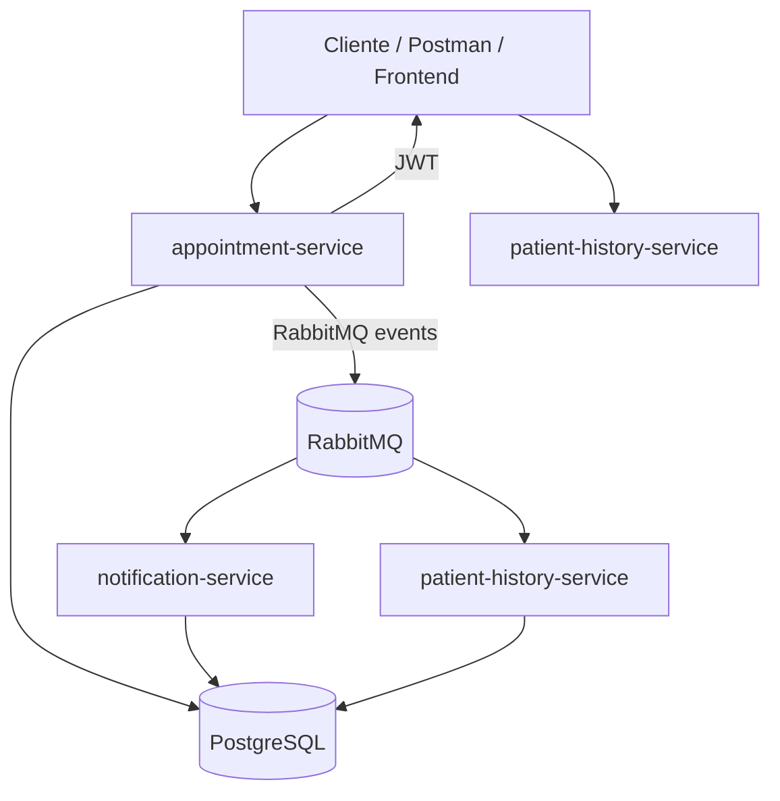

# Arquitetura

## Justificativa

- O `appointment-service` concentra autenticação e comandos transacionais para evitar múltiplos emissores de JWT.
- O `notification-service` é isolado para processamento assíncrono e retry simples.
- O `patient-history-service` mantém projeção local para consultas GraphQL sem acoplar o histórico ao write model.
- Um único PostgreSQL simplifica operação, mas cada serviço usa schema próprio para preservar ownership.
