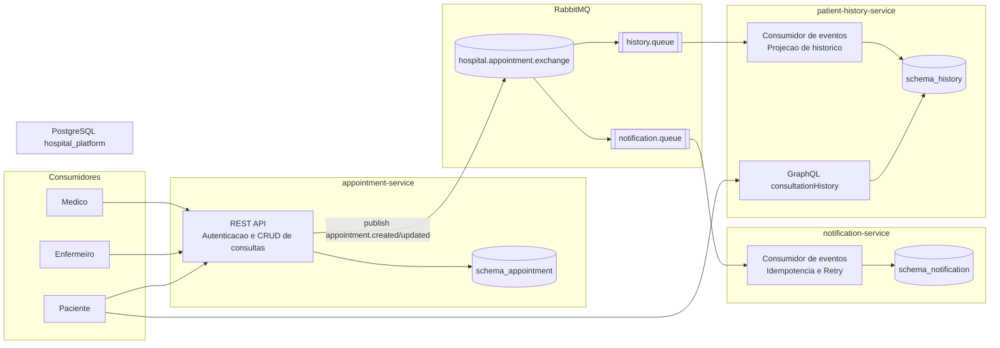

```mermaid
flowchart LR
  subgraph Clients[Consumidores]
    U1[Medico]
    U2[Enfermeiro]
    U3[Paciente]
  end

  subgraph S1[appointment-service]
    A1[REST API\nAutenticacao e CRUD de consultas]
    A2[(schema_appointment)]
  end

  subgraph MQ[RabbitMQ]
    EX[(hospital.appointment.exchange)]
    QN[[notification.queue]]
    QH[[history.queue]]
  end

  subgraph S2[notification-service]
    N1[Consumidor de eventos\nIdempotencia e Retry]
    N2[(schema_notification)]
  end

  subgraph S3[patient-history-service]
    H1[Consumidor de eventos\nProjecao de historico]
    H2[GraphQL consultationHistory]
    H3[(schema_history)]
  end

  subgraph DB[PostgreSQL hospital_platform]
    A2
    N2
    H3
  end

  U1 --> A1
  U2 --> A1
  U3 --> A1
  A1 --> A2
  A1 -->|publish appointment.created/updated| EX
  EX --> QN --> N1 --> N2
  EX --> QH --> H1 --> H3
  U3 --> H2
  H2 --> H3
```
