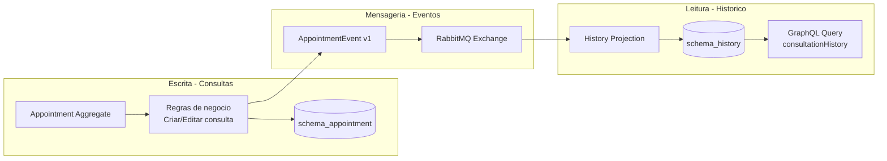

```mermaid
flowchart LR
  subgraph Write[Escrita - Consultas]
    W1[Appointment Aggregate]
    W2[Regras de negocio\nCriar/Editar consulta]
    W3[(schema_appointment)]
  end

  subgraph Messaging[Mensageria - Eventos]
    M1[AppointmentEvent v1]
    M2[RabbitMQ Exchange]
  end

  subgraph Read[Leitura - Historico]
    R1[History Projection]
    R2[(schema_history)]
    R3[GraphQL Query\nconsultationHistory]
  end

  W1 --> W2 --> W3
  W2 --> M1 --> M2
  M2 --> R1 --> R2 --> R3
```
