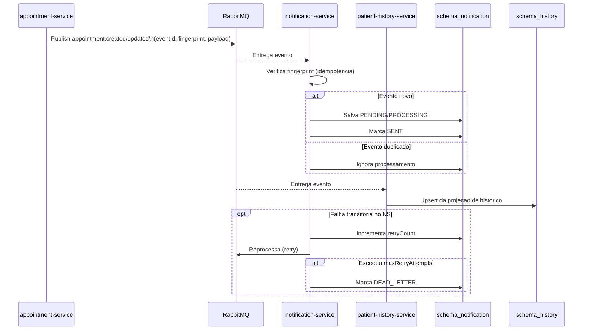

```mermaid
sequenceDiagram
  participant AP as appointment-service
  participant MQ as RabbitMQ
  participant NS as notification-service
  participant HS as patient-history-service
  participant NDB as schema_notification
  participant HDB as schema_history

  AP->>MQ: Publish appointment.created/updated\n(eventId, fingerprint, payload)
  MQ-->>NS: Entrega evento
  NS->>NS: Verifica fingerprint (idempotencia)
  alt Evento novo
    NS->>NDB: Salva PENDING/PROCESSING
    NS->>NDB: Marca SENT
  else Evento duplicado
    NS->>NDB: Ignora processamento
  end

  MQ-->>HS: Entrega evento
  HS->>HDB: Upsert da projecao de historico

  opt Falha transitoria no NS
    NS->>NDB: Incrementa retryCount
    NS->>MQ: Reprocessa (retry)
    alt Excedeu maxRetryAttempts
      NS->>NDB: Marca DEAD_LETTER
    end
  end
```
