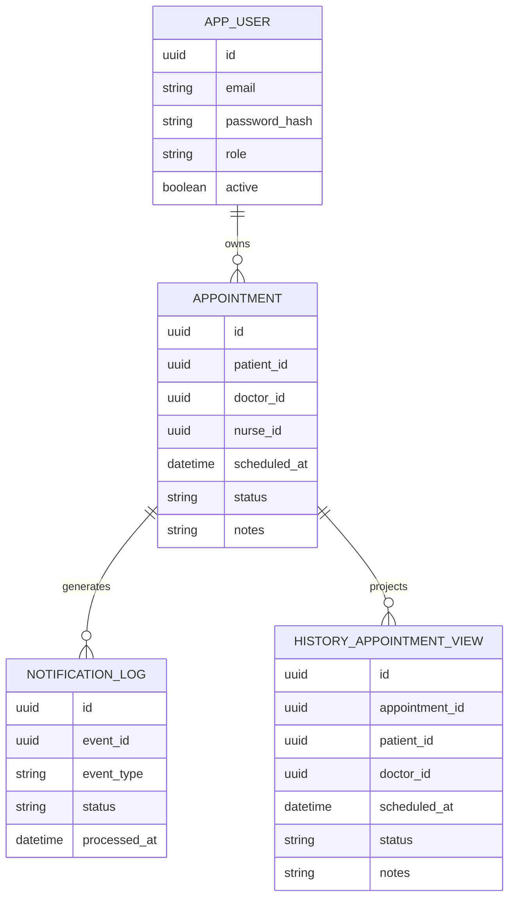

# Modelagem resumida

```mermaid
erDiagram
    APP_USER ||--o{ APPOINTMENT : owns
    APPOINTMENT ||--o{ NOTIFICATION_LOG : generates
    APPOINTMENT ||--o{ HISTORY_APPOINTMENT_VIEW : projects

    APP_USER {
        uuid id
        string email
        string password_hash
        string role
        boolean active
    }

    APPOINTMENT {
        uuid id
        uuid patient_id
        uuid doctor_id
        uuid nurse_id
        datetime scheduled_at
        string status
        string notes
    }

    NOTIFICATION_LOG {
        uuid id
        uuid event_id
        string event_type
        string status
        datetime processed_at
    }

    HISTORY_APPOINTMENT_VIEW {
        uuid id
        uuid appointment_id
        uuid patient_id
        uuid doctor_id
        datetime scheduled_at
        string status
        string notes
    }
```
